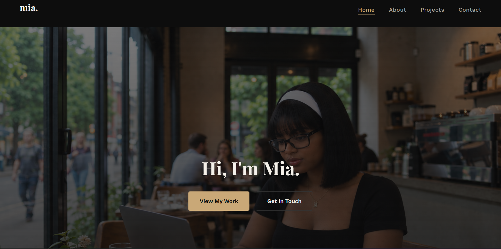
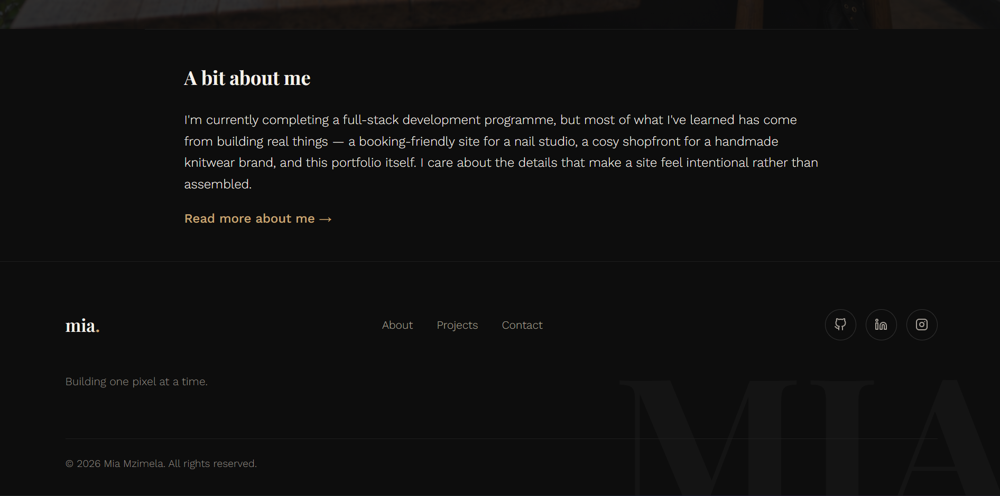
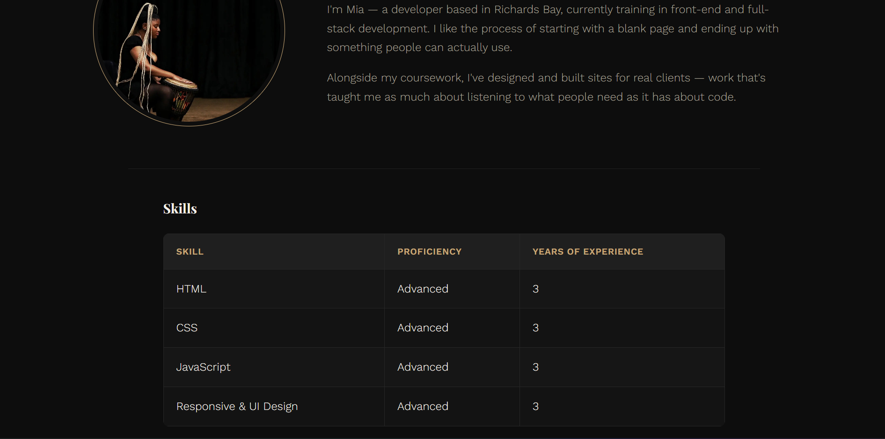
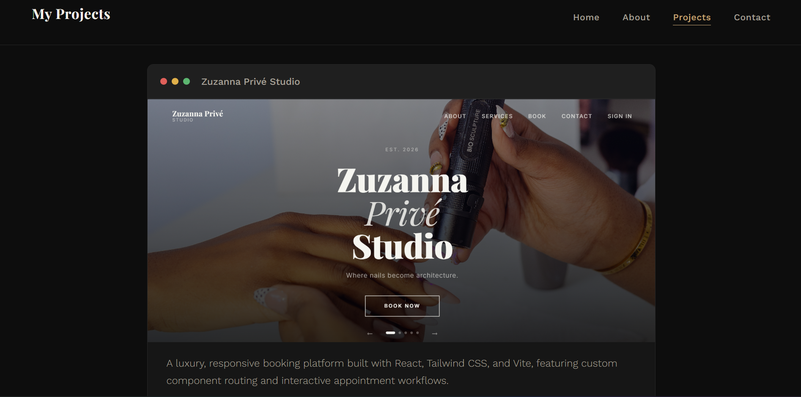
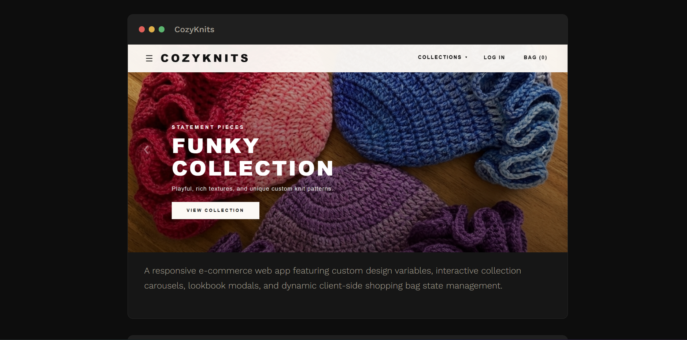
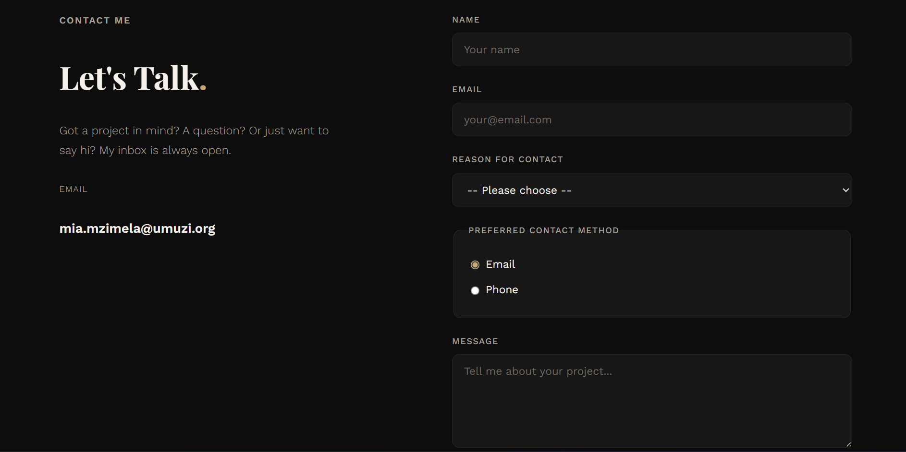
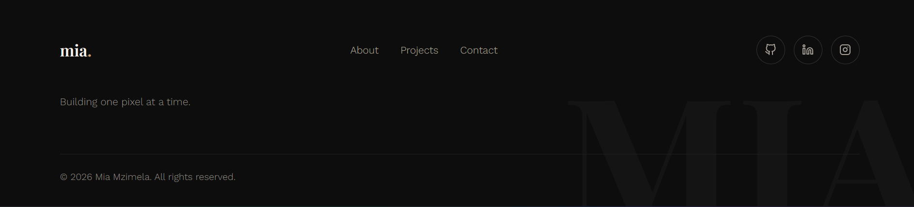

# Mia Mzimela — Portfolio Website

A four-page personal portfolio site (Home, About, Projects, Contact) built by debugging and rebuilding a starter codebase that was roughly 70% complete. This capstone project focuses on semantic HTML, accessible forms, and CSS fundamentals.

## Overview

The site introduces me as a front-end developer in training, with a home page, an about page with a skills table, a projects page showcasing three pieces of work, and a contact page with a working form. The design direction is dark and editorial — near-black background, a warm gold accent, serif headings paired with a clean sans body font.

## Issues Found

The starter code had a mix of structural and styling problems:
- No semantic HTML5 elements — everything was wrapped in generic `
`, `
`, etc.
- No navigation menu at all on any page
- Missing meta tags (charset, viewport) and no `lang` attribute
- Images had no alt text
- The About page was missing its data table entirely
- The Projects page was missing a third project
- The contact form used `placeholder` text instead of real `<label>` elements, had only two input types, and no validation attributes
- The CSS only used 2–3 selector types, had no pseudo-classes, a colour contrast failure (light text on a light background), and no table, form, or navigation styling

## Fixes Implemented

I rebuilt each page with proper semantic structure (`header`, `nav`, `main`, `section`, `article`, `footer`), added a consistent nav menu across all four pages, added alt text to every image, built the missing skills table, added the missing third project, and rebuilt the contact form with real labels, five input types (text, email, select, radio, textarea), and validation (`required`, `minlength`). On the CSS side I expanded past five selector types, added `:hover`/`:focus` states, fixed the contrast failure, and styled the nav, table, and form from scratch.

## HTML Structure & Semantic Choices

Every page follows the same skeleton: `header` (with `nav`) → `main` (containing page-specific `section`/`article` elements) → `footer`. I kept non-semantic `
` use to a minimum — mainly for layout grouping in the footer — and used `
` and `<fieldset>` instead of extra divs to wrap form fields, keeping div usage well under the assignment's limit.

## CSS Approach & Selectors

The stylesheet uses element, class, ID, descendant, attribute (`[aria-current="page"]`), and pseudo-class selectors (`:hover`, `:focus`, `:nth-child`). Box model properties (margin, padding, border) are used throughout for spacing and the card/table layouts. Colours were checked against WCAG AA contrast requirements — all text on the site meets at least a 5:1 ratio.

## Accessibility Improvements

Every image has descriptive alt text, every form input has an associated `<label>`, the radio group is wrapped in a `<fieldset>`/`<legend>`, and focus states are visible for keyboard navigation. The active page in the nav is marked with `aria-current="page"`.

## How to View Locally

1. Download or clone this repository
2. Open the folder in VS Code (or any editor)
3. Right-click `index.html` and open with the Live Server extension, or simply double-click `index.html` to open it directly in your browser

## Screenshots

**Home page**

**About page**

**Projects page**

**Contact page with form**

**Navigation Bar, Footer, Skills Table and Contact Form**

## Reflection

The trickiest part wasn't the individual bugs — it was catching what wasn't obvious at first glance, like the non-semantic div limit on the contact form, or a colour combination that looked fine but failed contrast testing. Running the HTML and CSS through validators after every major change caught things I'd have otherwise missed. Rebuilding the contact form with `
` and `<fieldset>` instead of `
` wrappers was a good reminder that accessibility and code-quality requirements often point to the same fix.